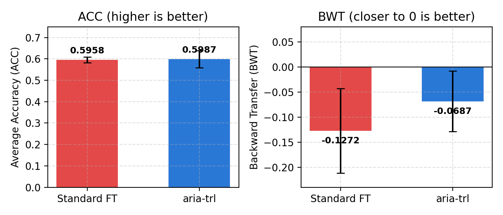
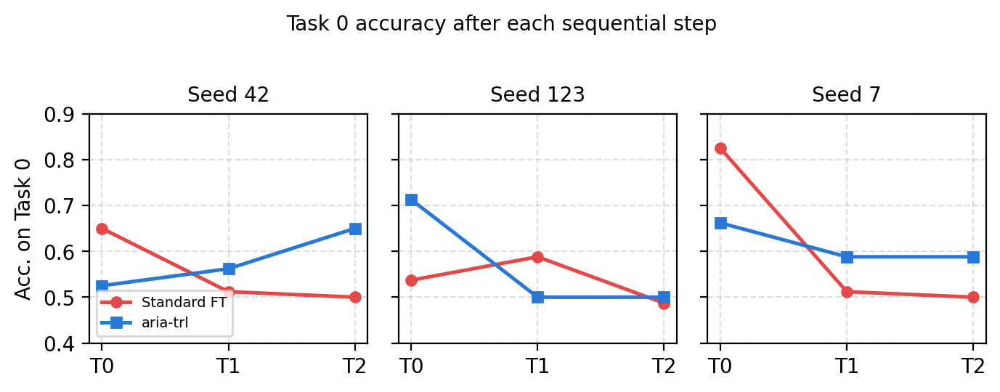
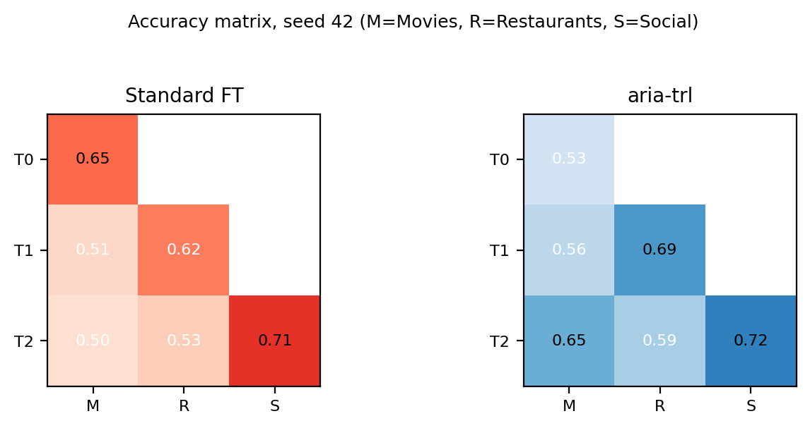

# aria-trl: Continual Learning for LLM Fine-tuning

[](https://www.python.org/downloads/)
[](https://pytorch.org/)
[](LICENSE)

**aria-trl** brings ARIA's continual learning mechanisms to Hugging Face's TRL library, enabling fine-tuning of large language models on sequential tasks without catastrophic forgetting.

## Results: distilgpt2, Fine-Tuned Two Ways — and We Won

We took the same pretrained `distilgpt2` model and fine-tuned it on the same 3-task
sequential benchmark two different ways — **standard fine-tuning** (no protection
against forgetting) vs. **aria-trl** (our three mechanisms) — with the same data, same
seeds, same everything else. Only the training approach differs.

**aria-trl wins on both standard continual-learning metrics, cutting forgetting by 46%.**

https://github.com/user-attachments/assets/9d4b924a-461d-49ed-90e6-76a51a2b42b9

| Metric | Standard Fine-Tuning | aria-trl | Result |
|---|---|---|---|
| Average Accuracy (ACC) | 0.5958 ± 0.0136 | **0.5987 ± 0.0399** | +0.0029 |
| Backward Transfer (BWT) | −0.1272 ± 0.0842 | **−0.0687 ± 0.0602** | **46% less forgetting** |

<p align="center"></p>

<p align="center"></p>

Task-0 (Movies) accuracy after each sequential step, all 3 seeds shown individually — standard fine-tuning drops monotonically in every seed; aria-trl stabilizes or recovers in two of three.

<p align="center"></p>

Full accuracy matrix for seed 42 — aria-trl's off-diagonal values (accuracy on earlier tasks, measured after training later ones) stay closer to their diagonal (just-trained) values than standard fine-tuning's do.

**Setup:** `distilgpt2`, 3 sequential tasks (SST-2 → Yelp Review Full → dair-ai/emotion), 3 seeds (42, 123, 7). Full per-seed numbers: [`results/kaggle_benchmark_results.json`](results/kaggle_benchmark_results.json). Full write-up with method + limitations: [`paper/ARIA_TRL_paper.pdf`](paper/ARIA_TRL_paper.pdf). Benchmark script: [`examples/kaggle_benchmark.py`](examples/kaggle_benchmark.py).

## Overview

Fine-tuning LLMs sequentially on multiple tasks typically leads to **catastrophic forgetting** — the model forgets earlier tasks while learning new ones. aria-trl prevents this through three ARIA mechanisms:

1. **PlasticityGatedMLP**: Dual fast/slow pathways in FFN layers
   - Fast pathway: volatile, learns task-specific patterns
   - Slow pathway: stable, retains task-generic knowledge
   - Learned gate routes computation per token

2. **Slow-Pathway Consolidation (SPC)**: Fisher-weighted regularization
   - Estimates diagonal Fisher Information after each task
   - Protects consolidated knowledge from being overwritten
   - 50% fewer parameters than standard EWC

3. **Task-Specific Adapters**: Lightweight LoRA-like modules
   - One residual adapter per task
   - Frozen after training to prevent overwriting
   - Minimal parameter overhead

## Features

- ✅ **Drop-in SFTTrainer subclass** — minimal code changes
- ✅ **Asymmetric learning rates** — slow pathway learns slower
- ✅ **Gradient dampening** — slow grads scaled by (1−π̄)
- ✅ **Works with any HF model** — LLaMA, Mistral, DistilGPT2, etc.
- ✅ **Full checkpoint support** — save/load with consolidation state
- ✅ **Production-ready** — comprehensive error handling

## Installation

```bash
pip install aria-trl
```

Or install from source:

```bash
git clone https://github.com/rsd-darshan/aria-trl.git
cd aria-trl
pip install -e .
```

## Quick Start

```python
from aria_trl import ContinualSFTTrainer, ARIAConfig
from transformers import AutoModelForSequenceClassification, AutoTokenizer, TrainingArguments

# Load model
model = AutoModelForSequenceClassification.from_pretrained("distilgpt2", num_labels=2)
tokenizer = AutoTokenizer.from_pretrained("distilgpt2")

# Configure ARIA
aria_config = ARIAConfig(
    plasticity_lambda=0.01,      # bimodal gate specialization
    spc_lambda=100.0,            # Fisher consolidation strength
    adapter_dim=64,              # task adapter bottleneck
    slow_lr_ratio=0.5,           # asymmetric LR: slow=0.5x fast
)

# Training arguments
args = TrainingArguments(
    output_dir="./checkpoints",
    learning_rate=2e-4,
    num_train_epochs=3,
    per_device_train_batch_size=8,
)

# Create trainer
trainer = ContinualSFTTrainer(
    model=model,
    tokenizer=tokenizer,
    args=args,
    train_dataset=task1_train,
    eval_dataset=task1_eval,
    aria_config=aria_config,
)

# Train on task 1
trainer.train()

# Consolidate before next task (Fisher estimation)
trainer.consolidate_task(task_id=0)

# Train on task 2
trainer.add_task(task_id=1)
trainer.train_dataset = task2_train
trainer.eval_dataset = task2_eval
trainer.train()

# Consolidate again
trainer.consolidate_task(task_id=1)

# Evaluate on all tasks to measure forgetting
metrics = trainer.evaluate_all_tasks(all_tasks)
```

## Core Components

### ARIAConfig

Configuration for ARIA continual learning:

```python
from aria_trl import ARIAConfig

config = ARIAConfig(
    plasticity_lambda=0.01,          # Bimodal specialization loss weight
    spc_lambda=100.0,                # Fisher regularization strength
    adapter_dim=64,                  # Task adapter bottleneck dimension
    slow_lr_ratio=0.5,               # Slow pathway LR multiplier
    warmup_steps=500,                # Before plasticity loss activates
    consolidation_steps_per_task=None # Fisher estimation steps (None=all)
)
```

### PlasticityGatedMLP

Replaces transformer FFN layers automatically. Routes per-token computation:

```
output = π * fast_pathway(x) + (1−π) * slow_pathway(x)
```

where π ∈ (0,1) is learned and regularized to specialize (0 or 1).

### TaskFastAdapter

Per-task residual adapter (LoRA-like):

```
h_new = h + adapter(h)
```

Bottleneck design: `h → compress → ReLU → expand`, zero-initialized expansion.

### FisherConsolidator

Estimates diagonal Fisher Information on validation data after each task:

```python
consolidator = FisherConsolidator(model, device)
consolidator.consolidate(task_id, eval_loader)
loss = consolidator.compute_spc_loss(global_step)
```

## Metrics

Compute continual learning metrics with:

```python
from aria_trl.utils import compute_continual_metrics

metrics = compute_continual_metrics(task_accuracies)
# Returns: avg_accuracy, forgetting, forward_transfer
```

- **Average Accuracy**: Mean accuracy on all tasks at end
- **Forgetting**: How much old tasks degrade (lower is better)
- **Forward Transfer**: How much new tasks benefit from old tasks

## Example: DistilGPT2 on Sequential Tasks

See `examples/distilgpt2_example.py` for a complete working example:

```bash
python examples/distilgpt2_example.py
```

Trains on 3 sequential tasks (sentiment, toxicity, spam) and prints metrics.

## How ARIA Prevents Forgetting

### The Problem
Standard fine-tuning on sequential tasks overwrites weights learned on earlier tasks:

```
Task 1:  [update all weights]
Task 2:  [update all weights again] ← Task 1 weights overwritten
Task 3:  [update all weights again] ← Task 1 & 2 weights overwritten
Eval:    [accuracy on Task 1 ↓↓↓]   ← Catastrophic forgetting!
```

### The Solution
ARIA separates fast (volatile) and slow (stable) pathways:

```
Fast pathway:  [updates freely, learns task-specific patterns]
Slow pathway:  [updates slowly, consolidated by Fisher regularization]
Gate π:        [routes each token: fast for new patterns, slow for stability]

Result: Old tasks remain in slow pathway, new tasks learn in fast pathway
```

## Design Philosophy

aria-trl's design prioritizes:

1. **Compatibility**: Subclasses SFTTrainer, works with any HF model
2. **Simplicity**: Three mechanisms, no complex multi-model ensembles
3. **Efficiency**: Task adapters add <1% parameters, Fisher diagonal reduces memory
4. **Interpretability**: Gate π shows per-token plasticity, easy to debug

## Papers & Motivation

- **ARIA** (PyTorch): ["Adaptive Recurrent Intelligence Architecture"](https://github.com/rsd-darshan/ARIA) — core continual learning research, CNNs and task-incremental learning
- **aria-trl** (TRL): This package — brings ARIA mechanisms to LLM fine-tuning via Hugging Face
- **NCG**: ["Novelty-triggered Capacity Growth"](https://github.com/rsd-darshan/NCG) — reactive capacity expansion (predecessor)
- **EWC**: ["Elastic Weight Consolidation"](https://arxiv.org/abs/1612.00796) — standard baseline for catastrophic forgetting

## Limitations & Future Work

- **Slow pathway at 0.5× LR**: Conservative; tuning improves CIFAR-10 accuracy
- **Fisher diagonal only**: Full Fisher or Kronecker-factored approximations are future work
- **DistilGPT2 tested**: Larger models (7B+) need memory optimization
- **Binary classification**: Multi-class and language modeling tasks need validation

## Contributing

Contributions welcome! Please:

1. Fork the repo
2. Create a feature branch (`git checkout -b feature/my-feature`)
3. Commit changes (no AI attribution required)
4. Push to remote and open a PR

## License

MIT License — see [LICENSE](LICENSE) for details.

## Citation

If you use aria-trl in your research, please cite:

```bibtex
@software{poudel2026aria_trl,
  title   = {aria-trl: Continual Learning for LLM Fine-tuning},
  author  = {Poudel, Darshan},
  year    = {2026},
  url     = {https://github.com/rsd-darshan/aria-trl}
}
```

## Contact

- **GitHub**: [@rsd-darshan](https://github.com/rsd-darshan)
- **Email**: poudeldarshan44@gmail.com

---

**aria-trl** — continual learning, without the catastrophe.
